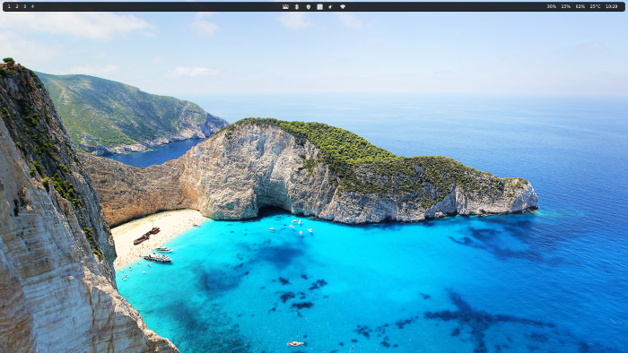

<!-- TOC -->

- [Linux Os maintainance Automation](#linux-os-maintainance-automation)
    - [Introduction](#introduction)
    - [First Run](#first-run)
    - [Maintainance Run](#maintainance-run)
    - [Backups](#backups)
- [Why using ansible?](#why-using-ansible)

<!-- /TOC -->
# Linux Os maintainance Automation

This ansible playbook will set up and maintain my personal linux environment.

The playbook:

- Ensures all packages are installed, updated and configured as I need
- Ensures all hardware drivers are installed and working
- Ensures my work and personal user accounts are configured
- Ensures my development environments are installed, updated and configured
- Ensures the system is ready for some minimal gaming (mostly steam and xbox controller)
- TODO: Ensures the firewall is installed, updated and configured
- TODO: Ensures backup scripts and crons are working

## Introduction

Some of the main software I use.

- **OS:** [manjaro i3 edition](https://manjaro.org/download/#i3)
- **Window Manager:** [i3](https://i3wm.org/)
- **Bar:** [polybar](https://github.com/polybar/polybar)
- **Application Launcher:** [rofi](https://github.com/davatorium/rofi)
- **Terminal:** [Alacritty](https://alacritty.org/)



## First Run
Just after you installed the latest version of [Manjaro i3 edition](https://manjaro.org/download/#i3) run the following commands to prepare the system, clone the source from gitlab and run the playbook. Resolve the errors that might occur.
Once the playbook ran successfully the system should be ready for use. 

```
sudo pacman -Suy
sudo pacman -S ansible

sudo mkdir /home/common
sudo chown $USER:common /home/common

cd /home/common
git clone git@gitlab.com:diffy0712/arch-boot.git

cd arch-boot

make idep
make run
```

## Maintainance Run

Run the playbook to install applications and update the system. 

```
make run
```

> Feel free to comment out role calls in `main.yml` to skip parts of the playbooks.  

> If multiple systems are using this playbook you might want to `git pull` first before running it.


## Backups

The `main.yml` playbook will set up the `/home/common/` folder and does backups on the imporant folders.

TODO


# Why using ansible?

Before I used different methods for managing my dotfiles (yadm, bash scripts), but none of them suited my needs. 

Using ansible, I can manage my whole system using only one tool.
Also I am really confortable with ansible since I manage my remote servers using ansible as well.